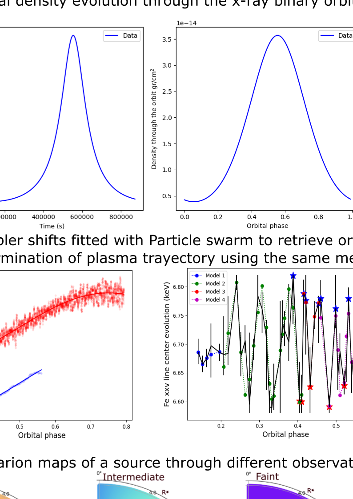

# Summary

X-ray astronomy is a young discipline, spanning no more than a few decades. The Earth's atmosphere is opaque to this type of radiation, so observations in this part of the spectrum had to wait until the beginning of the space era, with rocket launchers that could carry X-ray telescopes, to reveal the universe from a brand new point of view.

X-ray binary systems consist of two stars in close orbit around each other, where one of the stars is typically a compact object such as a neutron star or a black hole. The compact object accretes matter from its companion star, which can be a main sequence star, a giant star, or even another compact object. The X-ray radiation in these systems is generated through the accretion of matter from the companion's powerful stellar wind, typical of these early type stars (Frank et al. 2002).

On the other hand, close binaries may become compact-object mergers and eventually sources of gravitational waves and/or short $\gamma$-ray bursts. They will also provide insight on the behavior of matter at extreme gravitational and magnetic fields. Understanding these processes is fundamental to modern astrophysics and has been the driver of multiple theoretical and observational studies (Abbott et al. 2017).

The study of orbital modulations in X-ray binaries provides crucial insights into their physical properties and dynamics. These modulations can be overlooked, as the lack of resolution of current instruments (Chandra or Xmm) prevents from obtaining the adequate data, unless the modulation is prominent enough, which also depends on the system properties and the brightness of the source, however, upcoming telescopes like XIFU in Athena (Barret et al. 2016) and XRISM (XRISM Science Team 2022), with their much higher resolution will amplify the importance of these analyses. These advanced instruments hold the promise of delivering deeper insights into the intricate dynamics of X-ray systems.

Orbital modulations are complex and depend on several parameters and geometrical considerations which make their execution a little bit tedious. With these packages, we provide a series of user-friendly functions, useful in most analysis which will allow astronomers to easily apply this type of analysis.

# Science behind

## Conservation of angular momentum in orbital mechanics:

If the eccentricity of our system is different than 0, the orbital phase will not vary linearly with the observational time, as the speed will increase at periastron primarily due to the conservation of angular momentum, which dictates that as the compact object moves closer to the central star, it must travel faster to maintain the total angular momentum of the system. This relationship is further influenced by Kepler’s laws of planetary motion, which describe how objects sweep out equal areas in equal times, and the gravitational force between two bodies, which strengthens as they approach each other and weakens as they move apart (Carroll & Ostlie 2006).

$$ r^2 \cdot \omega = h $$

where:
- \( r \) is the orbital radius,
- \( \omega \) is the angular velocity,
- \( h \) is the specific angular momentum.

This equation illustrates how the angular velocity \( \omega \) increases as the orbital radius \( r \) decreases, maintaining the constant specific angular momentum \( h \) of the system.

We will take this fact into consideration in all our functions and provide dedicated functions to transform phase into time and vice versa.

## CAK model:

The CAK model, proposed by Castor, Abbott, and Klein in 1975 (Castor et al. 1975), is a theoretical framework used to describe radiation-driven winds in massive stars. These stars have strong stellar winds driven by the interaction between their radiation and the surrounding material.

The CAK model provides a quantitative description of how the wind velocity, density, and ionization state vary with distance from the star.

$$ \rho = \frac{\dot{M}}{4 \pi v R^2} $$

where:
- \( \rho \) is the density of the wind at a given distance \( R \),
- \( $$\dot{M}$$ \) is the mass accretion rate in grams per second,
- \( v \) is the orbital speed at distances greater than the stellar radius,
- \( R \) is the orbital radius at distances greater than the stellar radius.

In this package, we assume that the wind is spherically distributed and ionized.

## Accretion Luminosity and Ionization Parameter:

Accretion is the process by which gravitational potential energy is extracted from material accreting onto a gravitating body. This phenomenon serves as the primary power source in various types of close binary systems and is also believed to fuel active galactic nuclei and quasars. When considering a flux of matter with an accretion rate \( $$\dot{M}$$ \), the resulting luminosity (assuming all mechanical energy is radiated) is defined as the accretion luminosity:

$$ L_{ac} = \frac{GM \dot{M}}{R} $$

where:
- \( L_{ac} \) is the accretion luminosity,
- \( G \) is the gravitational constant,
- \( M \) is the mass of the gravitating body,
- \( $$\dot{M}$$ \) is the accretion rate,
- \( R \) is the characteristic radius associated with the accretion process.

The ionization parameter \( \xi \) is defined as:

$$ \xi = \frac{L_{\rm X}}{n(r_{\rm X}) r_{\rm X}^{2}} $$

where:
- \( L_{\rm X} \) is the X-ray luminosity,
- \( n(r_{\rm X}) \) is the local particle density at a distance \( r_{\rm X} \) from the X-ray source (such as a neutron star),
- \( r_{\rm X} \) is the distance from the X-ray source.

This parameter quantifies the ionization state of the surrounding medium due to X-ray radiation from the neutron star. We provide a function which calculates the ionization map if the binary system plane taking into account these calculations within the CAK frame.

## Doppler Effect:

The Doppler effect, named after the Austrian physicist Christian Doppler who first proposed it in 1842, is the change in frequency or wavelength of a wave in relation to an observer moving relative to the source of the wave.

In astronomy, the Doppler effect is used to analyze the motion of celestial objects by observing shifts in their emitted light. By measuring Doppler shifts in the spectra of stars and galaxies, astronomers determine radial velocities, study galactic rotation, identify exoplanets, and explore the expansion of the universe through cosmological redshift. The Doppler effect plays a pivotal role in deciphering cosmic motions and unraveling the mysteries of the cosmos.

In the context of X-ray binaries, the Doppler effect is evident in the pulsations of a neutron star (NS) orbiting its companion, allowing precise determination of orbital parameters like radius, mass, inclination, and eccentricity. Additionally, the Doppler effect influences emission line energies when the emitting plasma is in motion.

### Simple Models
- **Conic Orbit**: representing the movement of the compact object around the companion.
- **Logarithmic Spiral**: gravitational capture of matter which will eventually be captured by the stellar object.

### Composed Models
- **Conic Orbit in a Conic Orbit**: representing an accretion disc or ballistic movement around the compact object traveling around the companion.
- **Logarithmic Spiral in a Conic Orbit**: gravitational capture of matter by the compact object traveling in a conic orbit around the companion.

$$ r_{\text{main}} = \frac{b_{\text{main}} \cdot (1 - e_{\text{main}}^2)}{1 + e_{\text{main}} \cdot \cos(\phi_{\text{main}} - W_{\text{main}})} $$

$$ r_{\text{secondary}} = \frac{b_{\text{secondary}} \cdot (1 - e_{\text{secondary}}^2)}{1 + e_{\text{secondary}} \cdot \cos(\phi_{\text{secondary}} - W_{\text{secondary}})} $$

$$ r_{\text{spiral}} = a_{\text{spiral}} \times \exp(b \cdot 2\pi \phi) $$

The general equation for the Doppler velocity in terms of the orbital phase is:

$$ v_{D} = (-r\omega \sin\phi \sin i) $$

$$ \lambda_{D} = \lambda_{\text{rest}}\left(1+\frac{v_{D}}{c}\right) $$

where:
- \( r \) is the orbital radius,
- \( a \) is the semimajor axis,
- \( b \) the distance to the barycenter (the semimajor axis corrected by the reduced mass of the stellar system),
- \( e \) is the eccentricity,
- \( \phi \) the orbital phase,
- \( W \) the angle to the periapsis,
- \( \omega \) the angular velocity,
- \( i \) the inclination,
- \( \lambda_{\rm D} \) and \( \lambda_{\rm rest} \) the center of the emission line, Doppler shifted and at rest, respectively, in wavelength units. In the case of composed models, the Doppler effect will be the sum of the velocities involved in the system.

## Lomb-Scargle Periodogram:

The Lomb-Scargle periodogram is a method used in astrophysics and other fields to find the dominant frequencies in unevenly sampled data. It is particularly useful for detecting periodic signals with variable amplitudes and non-sinusoidal shapes. The periodogram computes the power spectral density of a time series, identifying the periodicities that best fit the observed data points.

In the context of X-ray astronomy and other observational sciences, the Lomb-Scargle method allows researchers to analyze irregularly spaced observations and extract information about periodic variations in X-ray flux, pulsations, or other cyclical phenomena.

# Functions and Methods

The functions contained in this package are the following: 

### Theoretical Functions
- **doppler_orbit_theoretical**: Calculates the Doppler effect in the orbital motion.
- **doppler_spiral_theoretical**: Models the Doppler effect in spiral structures.
- **doppler_disc_theoretical**: Models the Doppler effect in accretion discs.
- **doppler_spiral_in_orbit_theoretical**: Combines orbital and spiral Doppler effects.
- **density_through_orbit_theoretical**: Computes wind density through the orbit.
- **absorption_column_through_orbit_theoretical**: Calculates absorption column variations through the orbit.
- **ionization_map_phase**: Maps ionization levels across orbital phases.
- **orbital_phase_to_time**: Converts orbital phase to time.
- **orbital_time_to_phase**: Converts orbital time to phase.

### Fitting Functions
(Note: 'ps' stands for particle swarm optimization and 'ls' stands for least squares. Particle swarm optimization is preferred as least squares does not always converge.)
- **fit_orbit_ps**: Fits orbital parameters using particle swarm optimization.
- **fit_orbit_ls**: Fits orbital parameters using least squares.
- **fit_disc_ps**: Fits disc parameters using particle swarm optimization.
- **fit_disc_ls**: Fits disc parameters using least squares.
- **fit_spiral_ps**: Fits spiral parameters using particle swarm optimization.
- **fit_spiral_ls**: Fits spiral parameters using least squares.
- **fit_spiral_in_orbit_ps**: Fits combined spiral and orbit parameters using particle swarm optimization.
- **fit_spiral_in_orbit_ls**: Fits combined spiral and orbit parameters using least squares.
- **nh_orbit**: Calculates the column density (N_H) variations through the orbit.
- **fit_nh_ps**: Fits N_H variations using particle swarm optimization.

### Timing Functions
- **hr**: Calculates hardness ratios.
- **cr**: Computes count rates.
- **rebin_snr**: Rebins data to achieve a specific signal-to-noise ratio.
- **rebin_bins**: Rebins data into a specified number of bins.
- **fold_pulse**: Folds pulse profiles over the orbital period.
- **period_sliding_window**: Analyzes period changes using a sliding window method.

Within the Fitting functions, we use a particle swarm approach (Clerc & Kennedy 2002, Bratton & Kennedy 2007) as a classical least squares algorithm does not always converge.

# Statement of Need

Orbital modulations offer valuable insights into X-ray binary systems, although their application is not always straightforward due to the complexity of geometrical calculations and numerous involved parameters. Nearly all current studies on individual X-ray binaries can benefit significantly from the functions provided in this package.

Our package offers a diverse range of functionalities and a user-friendly interactive form-based method for inputting and saving all required parameters. It can be surprising how sensitive column density, ionization maps, or Doppler shifts are to slight variations in these parameters.

To streamline usability, we have implemented a user-friendly form system that allows all parameters to be saved and easily loaded for future interactions, eliminating the need for users to input them repeatedly.

The functions obtained in this package had already been used in published papers (Sanjurjo-Ferrín et al. 2021, 2022) and in others currently under referee process.

# Acknowledgements

This research has been funded by the ASFAE/2022/02 project from the Generalitat Valenciana. 

# References

