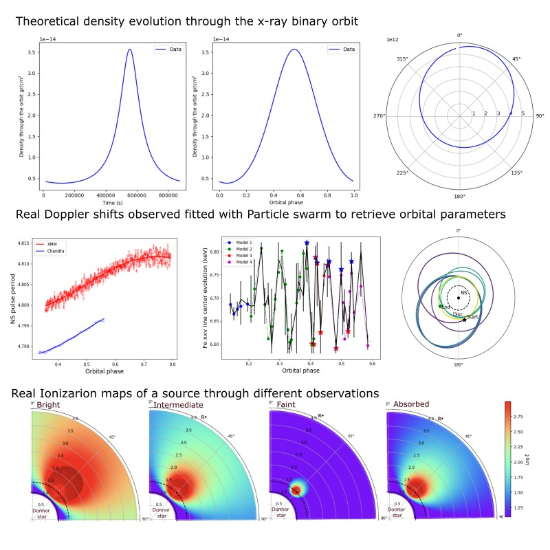

# Summary

X-ray astronomy is a young discipline, spanning no more than a few decades. The Earth's atmosphere is opaque to this type of radiation, so observations in this part of the spectrum had to wait until the beginning of the space era, when rocket launchers carrying X-ray telescopes revealed the universe from a brand-new point of view.

X-ray binaries are tremendously interesting systems. In these extreme environments, a compact object—either a neutron star or black hole—draws in matter from a companion star, producing intense X-ray emissions. These systems offer a unique window into extreme physics, from the effects of strong gravity and relativistic jets to the presence of intense magnetic fields.

Orbital modulations are observed in nearly all X-ray binary systems. These variations arise from the orbital motions of the system, driven by the relative velocities of the two stars and their changing configurations with respect to each other and the observer.

To aid in the study of these modulations, we introduce **xraybinaryorbit** , a user-friendly Python package designed to simplify the analysis of orbital modulations in X-ray binaries. 

# Science Behind

The package functions are based on the following key theories:

### Conservation of Angular Momentum

In systems with non-zero eccentricity, the orbital phase varies non-linearly with observational time due to increased speed at periastron, governed by the conservation of angular momentum. Kepler’s laws further explain that objects sweep out equal areas in equal times [2006ima..book.....C].

$$ r^2 \cdot \omega = Area $$

We account for this in all functions and provide tools to convert phase to time and vice versa.

### CAK Model

The CAK model ([1975ApJ...195..157C]) describes radiation-driven winds in massive stars, with wind velocity, density, and ionization state varying with distance from the companion star.

$$ \rho = \frac{\dot{M}}{4 \pi v R^2} $$

Here, $\rho$  is wind density, $\dot{M}$ is the mass loss rate, v is the wind velocity and R is the distance to the companion. We assume a spherical, smooth and un-ionized wind distribution.

### Accretion Luminosity and Ionization

Accretion powers many close binary systems @Frank_King_Raine_2002]. The accretion luminosity is given by:

$$ L_{ac} = \frac{G M \dot{M}}{R} $$

where L$_{ac}$ is the luminosity, G is the gravitational constant, M is the compact object mass, and R is the compact object radius. The ionization parameter $\xi$ is defined as:

$$ \xi = \frac{L_{\rm X}}{n(r_{\rm X}) r_{\rm X}^{2}} $$

We calculate the ionization map within the system plane based on these calculations.

### Doppler Effect

The Doppler effect helps determine orbital parameters in X-ray binaries, affecting emission line energies and enabling the analysis of radial velocities.

The Doppler velocity can be calculated as:

$$ v_{D} = (-r\omega \sin\phi \sin i) $$

The doppler length wave affected by Doppler effect be written as:

$$ \lambda_{D} = \lambda_{\text{rest}}\left(1+\frac{v_{D}}{c}\right) $$

where r is the orbital radius, $\omega$ is angular velocity, $\i$ is inclination, and $\lambda_{\rm D}$ and $\lambda_{\rm rest}$ are the Doppler-shifted and rest wavelengths, respectively.

{#sylt width="100%"}

## Technical Details of Software Usage

### General Usage

The software provides a user-friendly interface for managing the various parameters that influence orbital modulations. Upon first use, the user inputs parameters through a form, which are then saved in a file within the running directory. This file is automatically loaded in future runs, eliminating the need to re-enter all parameters.
 If the file is absent, the form will reappear for new inputs. Alternatively, setting `load_directly=True` will bypass the form and run the code using previously saved parameters (only if the file exists).

### Fitting Functions

For fitting orbital parameters, the software offers two approaches: least squares (LS) and particle swarm optimization (PSO) [@pyswarms,@10.1162/EVCO_r_00180], denoted by `_ls` and `_ps`, within the functions name respectively. The LS methods is faster but may fail to converge in certain cases, whereas the PS0 is more robust but computationally intensive. Key parameters for PSO include `num_iterations`, `maxiter`, and `swarmsize`. It is recommended to start with smaller values for these parameters (e.g., `num_iterations=3`, `maxiter=100`, and `swarmsize=20`) to evaluate computational demand and adjust accordingly. 

### Extended vs. Discrete Fitting

The software provides two fitting methods: `extended` and `discrete`. When fitting data to orbital modulation, a list of `values` corresponding to `time sections` (e.g., phase-resolved spectra or lightcurve segments, wich have a defined time lenght) will be our data to fit. For short-period orbital modulations, which are often sinusoidal, the center of the time section may not properly represent the modulation (that would be a discrete approach, i.e. an discrete time/orbital phase for a discrete value). Instead, it’s necessary to consider the average modulation across the entire `time section` and fit that to the observed `values`.

To handle this complexity, the `extended_binsize` parameter is used. If the size of the time section covers more than `extended_binsize` orbital phases (e.g., `extended_binsize=0.01`), the point is treated as extended; otherwise, it is treated as discrete authomatically, when the mode `extended`, which is the default, is selected. 

The `extended` approach can be utilized by providing a list of time pairs, or alternatively, a single list of times with one extra element compared to the `values` list, from which pairs will be created automatically. If the list of `times` is the same length as the `values` list, the `discrete` approach will be used instead, even if the `extended` method was selected (a warnig will appear indicating it so).

# Statement of Need

Within our observations, we might detect slight oscillating shifts in the center of emission lines and/or small variations in a neutron star's spin period. This phenomenon is likely caused by the Doppler effect. Our code helps translate this data into the orbital parameters responsible for such Doppler shifts.

However, this seemingly simple process becomes complex when accounting for several factors: inclination, eccentricity, periapsis, and distance to the barycenter (which depends on the masses of the stars involved) all play crucial roles. If the eccentricity is greater than zero, the velocity around the orbit is not constant, making the analysis even more intricate.

When considering stellar wind (the matter accreted by compact objects), various combinations of these factors result in orbital modulations. Eccentricity causes changes in wind density throughout the orbit, affecting the amount of accreted matter. Both eccentricity and inclination influence the absorption column faced by the emitted radiation and the ionization of the stellar wind, which also varies with orbital phase.

Although these orbital modulations are conceptually simple, they are challenging to analyze. At the same time, they can provide tremendous insights into the orbital mechanics and wind properties of our systems, may be helping to complete the puzzle when we already have some pieces of information or to give us a list of possible parameter combinations. This is where our tools provide valuable support.

Historically, the primary limitation in this type of analysis has been the lack of resolution for detailed phase-resolved observations. However, upcoming high-resolution missions like XRISM [@2022arXiv220205399X] and New Athena [@2016SPIE9905E2FB] promise to significantly improve the quality of these analyses. In addition to better resolution, advances in computational power have been crucial. Many of these tools have already been successfully applied to studies using XMM-Newton and Chandra data, enabling analyses that were previously impossible. [@2022MNRAS512304S; @2021MNRAS.501.5892S]

# Acknowledgements

This research has been funded by the ASFAE/2022/02 project from the Generalitat Valenciana. 

#References
